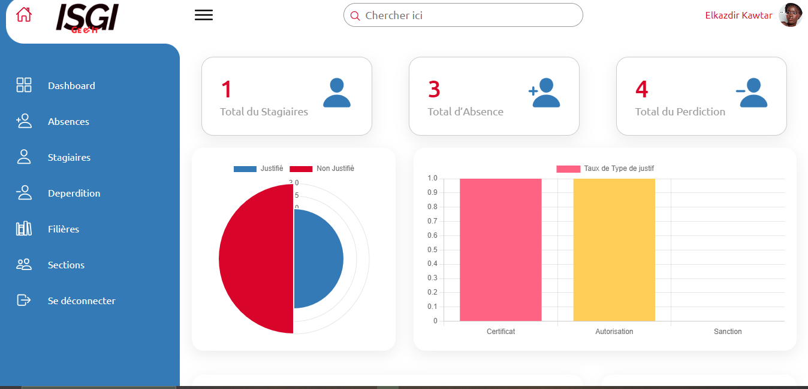
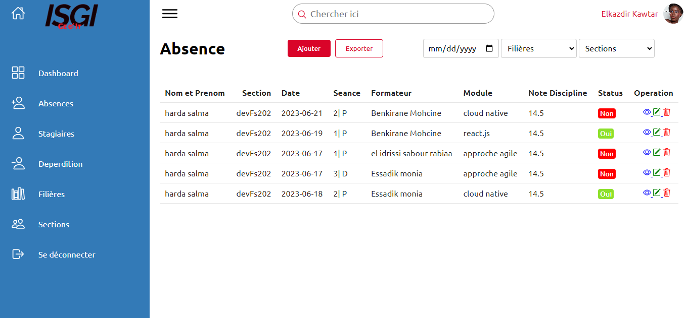
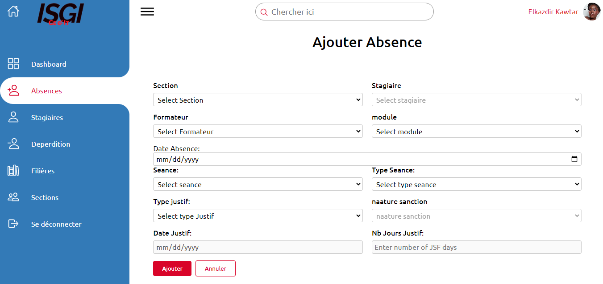
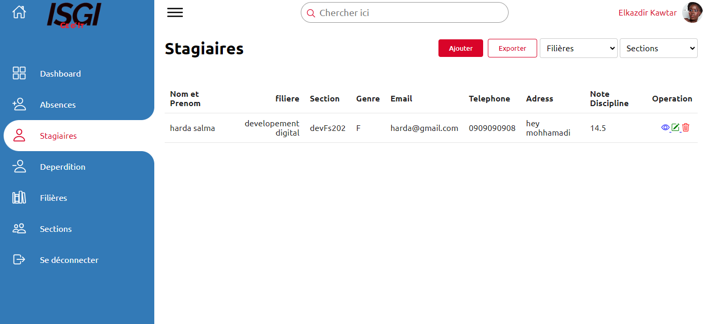
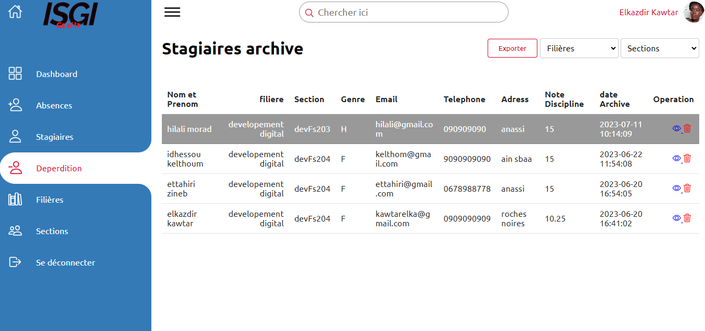
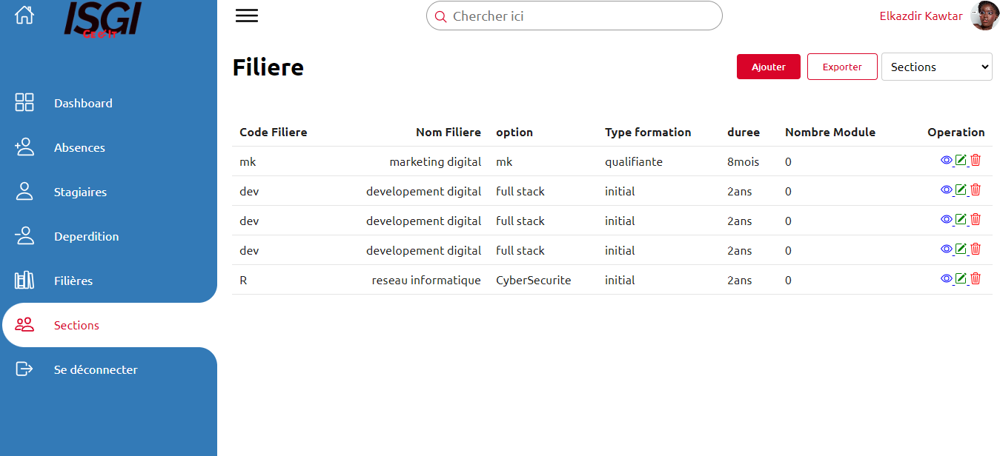
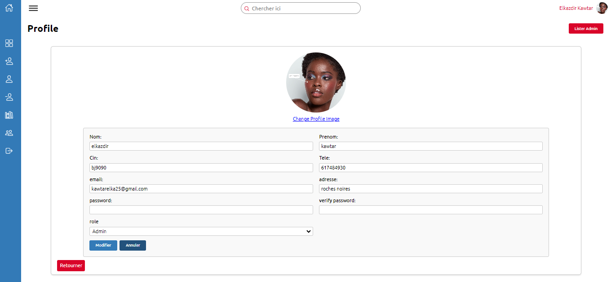
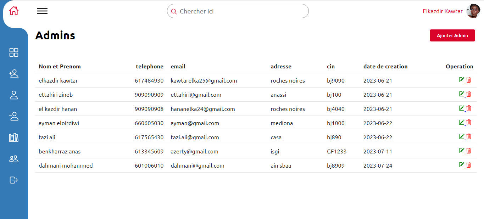
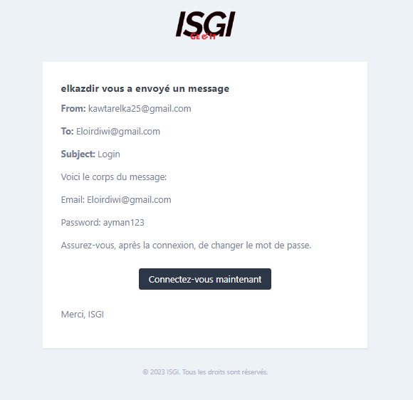
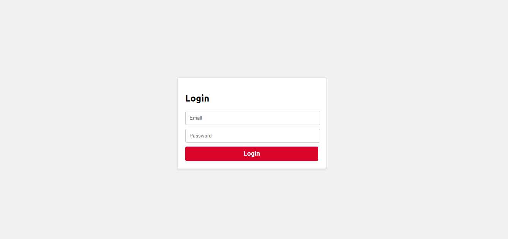

# Absence Management System for ISGI Institute

**Absence Management System for ISGI Institute** Efficient absence management solution for ISGI Institute, simplifying attendance tracking and record-keeping.

##    Table of Contents

*    About
*    Features
*    Installation
*    Usage
*    Contributing


##    About

The **Absence Management System for ISGI Institute** is a comprehensive solution designed to streamline attendance tracking and management. It offers features for managing absences, stagiaires, depredictions, sections, filieres, and user profiles. The system ensures accurate record-keeping and provides insightful statistics through a user-friendly dashboard.
##    Features

*    **Dashboard**: Display statistics about absences and students that quit using charts and tables.
*    **Absence Management:** Perform CRUD operations on absences, filter absences using various criteria, export data, and calculate discipline grades.
*    **Stagiaire Management:** CRUD operations for stagiaires, with filtering and export capabilities.
*    **Deprediction Management:** CRUD operations for students that quit, with filtering and export options.
*    **Section/Group and Filiere Management:** CRUD operations for sections/groups and filieres, with filtering and export features.
*    **Profile Management:** Modify profiles for assistance, add new users, delete users, list users, and modify their passwords and profiles for admins. Admin users can create new users, and login credentials are sent via email.
*    **Authentication and Authorization:** Users must log in to access any route. Two main roles: assistance and admin.

##    Installation

To run the Absence Management System locally, follow these steps:

```
# Clone the repository
git clone https://github.com/Kawkawa2/ISGI_Absence_management.git

# Change directory
cd ISGI_Absence_management

# Install dependencies
composer install

# Set up environment variables
cp .env.example .env
php artisan key:generate

# Configure the database in the .env file
# Run migrations
php artisan migrate

# Start the development server
php artisan serve

```

##    Usage

###    Dashboard

The Dashboard provides visual insights into absences and student data through charts and tables.



###    Absence Management

The Absence section allows CRUD operations on absences. Absences can be filtered, exported, and deleted if justified. Discipline grades are automatically calculated.





###    Stagiaire Management

The Stagiaire section enables CRUD operations for managing stagiaires, including filtering and export options.



###    Deprediction Management

The Deprediction section facilitates CRUD operations for managing students that quit, including filtering and export options.



###    Section/Group and Filiere Management

The Section/Group and Filiere sections allow CRUD operations, with filtering and export capabilities.



###    Profile Management

In the Profile section, assistance users can modify profiles, add new users, delete users, list users, and modify their passwords and profiles for admins. Admin users can create new users, and login credentials are sent via email.






##    Contributing

We welcome contributions from the community! To contribute to the Absence Management System, follow these steps:

1. Fork the repository on GitHub.
2. Clone your forked repository to your local machine.
3. Create a new branch for your feature or bug fix.
4. Make your changes and commit them with descriptive commit messages.
5. Push your changes to your branch on your forked repository.
6. Submit a pull request to the `main` branch of the original repository.
7. Your pull request will be reviewed, and once approved, it will be merged into the main codebase.
   
